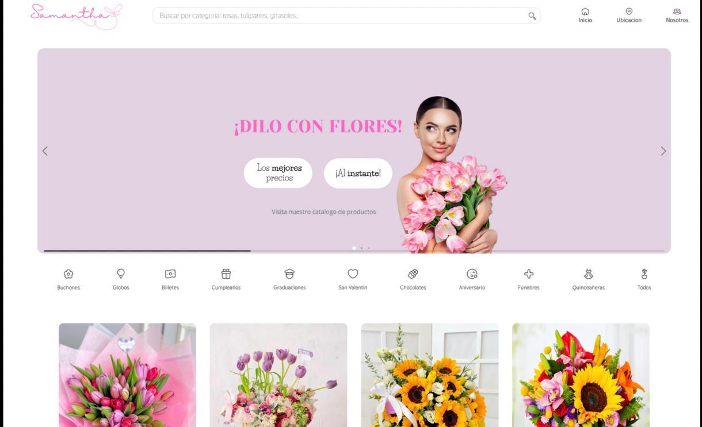
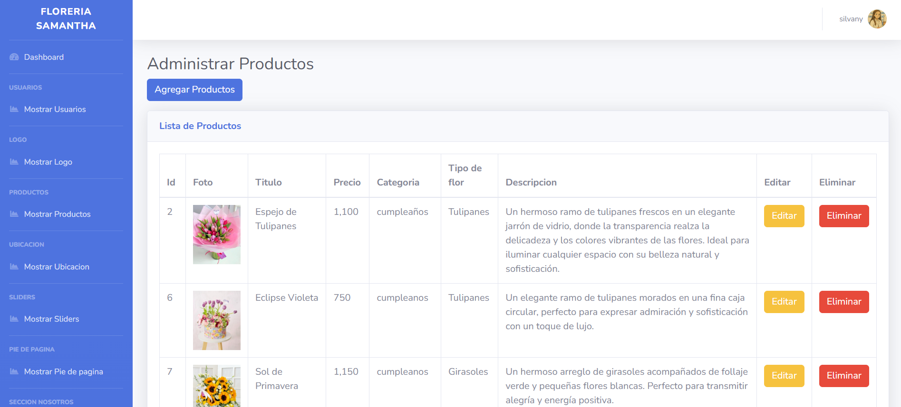

# Floreria Samantha 🌺

Sitio web desarrollado bajo el patrón de arquitectura MVC, diseñado para mostrar productos florales organizados por categorías como cumpleaños, aniversarios y ocasiones especiales.

## Panel administrativo
Cuenta con un panel administrativo para gestionar dinámicamente el contenido del sitio

## Tecnologías utilizadas

- HTML5
- CSS3
- JavaScript
- PHP
- MySQL
- Bootstrap
- MySQL
- Plantilla para el administrador
    - SBAdmin2
- Libreria:
   - SweetAlert2
 
  ##  Funcionalidades principales

- Administración de productos, ubicación, sliders, etc con formularios validados
- Funciones CRUD 
- Filtro de productos por categoría

  ## Funcionamiento 📽️
   
  

